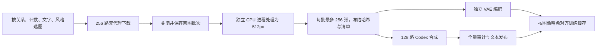

**B 512px：Codex CLI 直接合成**

> 历史记录：本文描述当时的协议和实际产物。当前执行以 [DATA_SYNTHESIS.md](DATA_SYNTHESIS.md) 为准：复用优先、SII 补缺纠错、重试耗尽后才用 Codex CLI；连接信息只从 SII 环境变量或静态 shell rc export 读取。

首轮已于 2026-09-13 05:39 UTC 完成：205,755 对图文（新生成 186,890 对，原样复用并核验
18,865 对），全量文本、图像/缓存、I2T/T2I 训练加载器及独立 50,000 张验证集验收全部通过。
最终目录为 `public/datasets/unified_image_text_512_sol_v1/releases/sol_100k_plus_corners_v1/`；
逐项完成证据见 `public/data_preparation/unified_b_512_sol_v1/final_dataset_completion.json`。

**正式大规模训练范围修正（2026-09-13）**

正式图库采用完整 ImageNet train（1,281,167 张）加补齐 corner cases 的图库。
当前首轮包含 100,433 张 ImageNet 和 105,322 张其他来源图像；按来源身份计算，
完整 ImageNet 加现有补充图库的候选规模为 1,386,489 张，最终以去重、评测排除和验收后数量为准。
首轮中的 ImageNet 原图属于完整 train，合并时不得重复增加这 100,433 张。

约 100K 是早期校准、旧文本复用与新协议验证的有限批次，不能当作正式训练删减 ImageNet 的依据。
剩余 1,180,734 张 ImageNet 尚未完成新协议处理，不能声称是质量筛选后淘汰。
当前 `sol_100k_plus_corners_v1` 的完整发布只指该封闭批次全部完成，
完整 ImageNet 的 512px 图文与缓存合并发布尚未生成，现有 0.6B YAML 仍是首轮验收入口。

扩展时逐图纳入完整 train，记录损坏、重复和评测重叠等排除原因，不继续设置 100K 上限。
已验收的图文和 512px 缓存按身份复用；其余图片固定 512px 训练视图后由 sol 复核旧六字幕和
faithful_photo 候选，必要时重写，并重新计算 1,024-token posterior，不能混入旧 256-token 缓存。
低分辨率原图单独记录放大事实，不把旧试验批次的分辨率 / 宽高比候选筛选当成全库完成证据。
图库保留范围与训练抽样权重分别定义：保留全部合格 ImageNet，同时按能力桶保证补充样本曝光。
ClimbMix 沿用现有语料；具体权重及大模型训练预算尚未冻结。

2026-09-12，按用户新指令停用 Qwen API 合成。当前入口是
`scripts/legacy/distill_b512_codex.py`：现有 Codex CLI，显式指定
`gpt-5.6-sol` 和 `model_reasoning_effort="low"`。每次调用附上已经完整解码的
512×512 RGB 图片，一次产出每图一对 I2T/T2I；旧合成文本只有重新验图通过才原样复用，
保留原作者模型来源。直接生成的文本不标记为经过独立教师二次评判。

生产配置采用初始并发 16 路，每批最多 8 张；每 8 个健康批次增加 8 路，
上限 128 路。传输故障触发退避、降并发和全局熔断，冷却后只放一个探测请求。
缺失或不合格的批内结果单独重试，其他合格结果立即提交。数据库使用 WAL、
单写者和排他锁；SIGINT/SIGTERM 停止补充任务并等待在途请求保存后退出。
CLI 顶层事件中的明确额度错误会停止补发、排空在途任务并保存为 `waiting_for_quota`，
不会作为普通网络错误循环重试。显式恢复时先放一个真实图片请求，成功后恢复并发。
2026-09-12 13:37 UTC 使用同一账号、同一模型的真实附图重试成功；此前因额度报错失败的
8 张已全部补齐，旧失败日志不能用来判断当前账号仍不可用。
2026-09-13 再次收到额度恢复通知后，单批 4 张真实附图请求成功，并通过命令、图片、
原始响应和事件流核验。生产队列从 16 路重新升至 128 路；恢复证据位于
`quota_retry_audits/resume_1789269262286163608/`，完成发布前仍须通过全部原有检查。

**目录与范围**

| 内容 | public 下的独立目录 |
| --- | --- |
| 合成文本与训练索引 | `datasets/unified_image_text_512_sol_v1/` |
| 原图、512px 图像及 VAE 二进制 | `datasets/unified_image_pool_512_v1/` |
| 队列、提示词、原始响应、完整事件及审计 | `data_preparation/unified_b_512_sol_v1/` |
| 已通过检查的首批 16 对 | `datasets/unified_image_text_512_sol_v1/releases/sol_calibration_v1/` |
| 已通过严格审计的 172,182 对进度快照 | `datasets/unified_image_text_512_sol_v1/releases/sol_progress_20260912/` |
| 已通过全部检查的 175,057 对第二版快照 | `datasets/unified_image_text_512_sol_v1/releases/sol_progress_20260912_r2/` |
| 已完成全部验收的 205,755 对全量发布 | `datasets/unified_image_text_512_sol_v1/releases/sol_100k_plus_corners_v1/` |

初始冻结队列共 103,351 张：ImageNet 100,433、OpenImages 651、PixMo 1,243、
WikiArt 1,024。图片全部来自已预处理的本地公共图片池；ImageNet 原始库位于
`public/dataset/imagenet/v1/ILSVRC/Data/CLS-LOC/train`，没有重新下载。
准备失败、已有评测排除以及重复项记录在 `scope_exclusions.jsonl`，不混入已声明范围。
完整输入身份与视图哈希写入 `scope.json`，在首次推理前登记所有任务。

用户随后要求持续补充图片。下载、512px 预处理、文本合成现已拆为独立服务。
本轮 5,569 个补充批次已全部接入并封闭，最终范围为 205,755 张，以 `scope.json` 为准；
初始范围另存 `base_scope.json`，各批次的新增数和重复排除记录在 `input_admissions/`。



新增来源包括 OpenImages 训练集的关系框、两个 PixMo-Cap 元数据分片、
[TextOCR 训练集](https://textvqa.org/textocr/dataset/)及两个新的 WikiArt 图片分片。
TextOCR 候选按缩放后至少两处可读文字、字高至少 10px 筛选；这些标注只用于选图，
不会作为合成答案直接写入文本库。PixMo 的计数、关系、文字和风格桶来自源描述筛选，
实际文本仍由 Codex 根据处理后的图片生成。各来源的 URL、版本和 SHA256 保存在供给计划及候选记录中。

下载服务按四类内容轮转，最多保留 32 个尚未完成预处理的原图批次。
每个站点最多 16 路，领取任务时跳过已满或仍在冷却的站点，避免单个慢站占满全局槽位；
单次外层任务上限 90 秒。已完成的下载不重复执行。恢复波次保留累计尝试次数和失败记录，
仅为临时网络错误、HTTP 429/5xx 增加有界的重试额度，403/404/410 等不自动重排。
此前被主机冷却和暂时性故障挡住的 49,791 个候选已保留审计并重新排队；
原批次关闭记录移入 `source_supply/recovery_waves/`，新图按后续批次编号继续接入。
Flickr 的同一链接在系统解析下超时、改用独立 HTTPS DNS 后可直连下载，已用真实图片复测。
下载器可通过 `--direct-dns-host live.staticflickr.com` 单独启用该路径：
DNS 查询使用 AliDNS，图片 GET 仍直接访问原站，curl 显式禁用代理和个人配置，
保留 TLS 验证、30 秒请求上限及 20 MiB 大小限制。全局 DNS、Codex 认证及代理不作修改。
实际下载方式与 DNS 解析服务写入原图批次记录。Reddit/Imgur 的同类测试仍未成功，保留重试记录。
Flickr 随后返回 HTTP 429，当前通过 `--direct-dns-rps 2` 在领取任务前均匀限速，
同时保留主机冷却；被限速而尚未领取的图片不增加尝试次数。其他站点继续使用全局并发池。

剩余外部链接另由 `scripts/recover_b512_pixmo_images.py` 批量补回。该服务固定
[PixMo 图片镜像](https://huggingface.co/datasets/anthracite-org/pixmo-cap-images)的
`3e42775eea79dd4874c41379230c7f871b10218e` 版本，先读取 Parquet footer 和 URL 列定位
已声明的缺图，再通过 [Dataset Viewer 的图片文件接口](https://huggingface.co/docs/dataset-viewer/rows)
直连下载对应图片，当前最多处理 64 个分页，元数据和图片共用 64 路 HTTP 请求上限。
分页进度仍按原来的 100 行区间保存，实际 API 请求仅包含目标图片最小行号到最大行号的范围。
只有一张缺图的分页只请求一行，减少无关元数据的读取；完整目标集合和逐图身份校验保持不变。
持续返回 5xx 的分页改为逐图获取元数据；5xx 仅使失败请求退避。
真实并行探测曾同时得到分页接口 HTTP 429 和图片接口 HTTP 200，因此两类接口分别共享
各自的 429 冷却。分页请求均匀限制为每秒最多 1 次；已排队请求取得连接槽位后重新检查
冷却，等待时释放槽位，图片下载继续使用可用并发。冷却截止时间持久保存，重启后继续遵守。
下载状态每 10 秒更新接口状态码、传输错误、在途请求数和冷却时间，方便区分限流与进程故障。
原失败分页的 29 张图片已全部补回并入库，逐张回读验证原始元数据、镜像版本、行号、
图片哈希和解码尺寸；完整核查保存在下载器重启记录的 `full_page_validation.json`。
索引阶段仅下载 URL 列及 footer；每个文件解析一次后复用签名 CDN 地址，避免为每个列范围
重复请求 Hub 解析接口。该路径已验证两个不同字节范围及准确的 HTTP 206/Content-Range。
原始 URL、caption、transcripts 必须与冻结的原始 PixMo 元数据完全一致；
这些源文本仅用于身份核对，不进入合成文本库。
同一 URL 对应多个镜像行时，按原始元数据哈希选择正确的标注版本，
保留实际镜像行号和对应 API 响应，不放宽元数据一致性检查。
Viewer 会将图片保存为保持尺寸的 JPEG/PNG，因此记录为镜像 rendition，不能宣称与原站文件字节相同。
每张图片保留镜像版本、行号、API 响应、图片哈希和解码尺寸；有原站字节哈希约束的候选仍须精确匹配。
图片位于公共图片池的 `source_archives/pixmo_mirror/`；下载状态在
`source_supply/mirror_recovery/status.json`，匹配范围与未匹配项在该目录的 `coverage.json`。

镜像服务每完成 8 张图片或缓冲满 5 秒即关闭并同步图片归档，再写成 `recovery_inbox/` 清单，
由原下载服务的唯一写者验收并登记。慢图不再阻挡同页已完成图片进入预处理，
中断时也会保存已经收到的图片；逐页完成状态仍单独记录。
导入只允许原有候选，保留原来的尝试次数和失败记录；已下载项不覆盖、不重复加入。
新增图片仍按最多 256 张组成原图批次，交给独立预处理和合成服务。
镜像恢复尚未结束或仍有未导入清单时，不允许关闭下载范围。
镜像下载支持断点恢复：冻结候选、URL 索引、逐页进度和已经保存的图片均会复用。
入口参数见 `source_supply/mirror_recovery/launch.json`；排他锁阻止重复启动写者。
2026-09-13 本轮 139,218 个候选已处理完：138,123 张下载成功，1,095 张原始下载失败，
全部成功项已形成 5,569 个冻结批次，预处理产出 102,430 张图像。
其余预处理记录保留具体拒绝原因；下载失败与预处理拒绝分别统计。
最后一张 7,400×5,600 的 PNG 为 28,697,824 字节，超过默认 20 MiB 下载限制。
恢复命令支持显式 `--max-image-bytes`，最高 128 MiB，镜像导入器同步使用该上限；
此图经过哈希、完整解码和元数据核验后入库。
固定镜像中另有一张图片的唯一 URL 对应不同 caption 和 transcripts，原站返回 404。
它保留在下载失败清单中。有限镜像扫描据此结束，并明确记录 `partial_image_coverage`，
没有将该样本计为下载成功或改写成质量排除。
收尾证据在 `source_supply/mirror_recovery/verified_coverage_completion.json`，
原始候选哈希保持不变；下载、预处理和输入队列各自的关闭记录均已写入。
预处理采用独立的两个 CPU 进程；计数和文字图等比缩放后补中性灰边，保留完整画面，
避免裁掉实例或字符。关系图优先裁切并保留标注中的两个目标；不能同时保留时使用完整画面补边。
所有结果仍为 RGB 512×512，补边位置、原始尺寸和图像哈希写入视图元数据。

关闭的图片批次以 `input_queue/supply-*.json` 接入合成。合成父进程独占数据库写入，
先验证批次文件哈希、跨批次图像去重、登记完整范围，再开始模型调用。
当两类队列都有任务时，原始队列与新增队列交替组批。
领取任务使用有序索引并限制返回行数，避免每次补充 worker 都扫描整个大队列。
所有源文件处理完、所有下载和预处理批次关闭、全部新增批次被接收、每条合成结果通过检查后，
才允许完整发布。

供给服务入口为 `scripts/supply_b512_images.py` 的 `candidates`、`download`、`prepare` 三个命令，
运行参数与进程记录在 `source_supply/services.json`，状态见 `download_status.json` 和
`prepare_status.json`，结束以对应的 `*.closed.json` 为准。新增 VAE 编码由
`scripts/encode_b512_supply.py` 持续读取冻结批次，使用只读连接检查源清单，避免更改已经送入合成的数据库。

文本目录只含合成样本、文本索引和元数据；不复制图片或 latent 二进制。
原消融数据、ClimbMix、原验证文本保持原位。下载器继续使用单独的无代理客户端；
Codex 继承原有认证和代理，不能关闭 mihomo 或调用 `clashctl off`。

**验收与训练衔接**

首批两次真实调用共 16 张全部完成：11 对验图后原样复用，5 对重新生成。
已核对原图/视图 SHA256、RGB 解码、附件顺序、结果 ID、原始 last-message、完整事件流、
线程 ID、模型参数、提示词和 schema 哈希、每段文本的真实 tokenizer 960-token 上限，
并逐条回读 gzip 分片和训练 seek index。另有中断排空、恢复保留已完成结果、
部分批次重试、事件完整性和熔断测试。少量视觉抽查不能代表全库事实准确率。

滚动补图接入后，另以只读数据库快照抽检 68 条已完成样本、66 个真实调用批次，
原图和 512px 视图哈希、完整调用证据、原始响应与入库文本、tokenizer 长度均通过。
四类新增图片各抽一张目视检查，主体、可确认的计数、关系、主要文字及风格与文本相符。
报告与持续运行观察分别保存在 `source_supply/rolling_sample_audit.json`、
`source_supply/rolling_execution_observation.json`。

首批 16 张的真实 KL16 VAE 与训练加载检查也已通过：posterior 为 `[16,1024,32]`，
I2T/T2I 使用相同的图像 latent；两种任务各检查全部 16 行及 4 个 micro-batch，
loss mask、padding 和跨 epoch 重采样符合预期。报告在准备目录
`pilot_training/training_loader_audit.json`，不包含模型 forward 或 NPU 训练。
编码器已加入源清单与输出清单不能同路径的保护。

图像缓存另有有限批次的 16 卡 Ascend 加速入口 `scripts/accelerate_b512_posteriors.py`。
它冻结当前图像清单，复用已有分片，完成本批后退出。实际运行发现当前共享盘的
`flock` 没有跨机器挡住并发写，因此 CPU/NPU 编码改为明确交接：暂停 CPU 控制器及写者，
记录 `cpu_handoff.json`，再运行 NPU 补齐；核验后恢复 CPU 控制器处理新增批次及索引。
NPU 入口要求 `--cpu-handoff`，普通文件锁仅用于同机互斥。原消融缓存保持原位。
排队期间 CPU 继续编码；节点启动后先补齐 Ascend 驱动库搜索路径，验证运行库和 16 卡可见性，
再发出就绪记录并等待 CPU 交接。这样可以在交接前发现节点启动环境问题。
已有补充图像缓存会在当前 CPU 进程中核验并构建索引，避免每个小批次重新启动编码器和索引进程。
真实 205 张缓存已通过该路径，另有错误分辨率缓存必须拒绝发布的测试。
第二批 16 卡任务已成功结束：回读检查全部 882 个计划分片，覆盖各 bank 合计 222,215 行
（包含独立的 50,000 张验证集，bank 间可能存在重复，不等于训练样本数）。
检查包含形状、ID、有限值、非负标准差、预处理模式和模型/源清单哈希；
随后恢复了 CPU 持续编码服务，交接和回读报告位于 `source_supply/npu_acceleration/wave2_fp32/`。
第三批任务也已成功结束，补齐 37 个新增 bank 的 2,515 张图像；该批计划中的
826 个分片、各 bank 合计 175,066 行全部通过回读核验。对应报告在
`source_supply/npu_acceleration/wave3_fp32/`。该批结束后恢复 CPU 持续编码服务，
继续接收后来准备完成的批次。
第四批补齐了 214 个 bank 的 5,805 张图像；本批补充源计划中的 976 个分片、
78,846 行全部通过回读核验，CPU 滚动编码已从验证后的缓存恢复。
报告位于 `source_supply/npu_acceleration/wave4_fp32_driver/`。
初次启动时缺少驱动库搜索路径的失败记录保存在 `wave4_fp32/`，该次未进入编码阶段。
后续 `wave5_fp32/` 又补齐 3,856 张图片的缓存，回读验证全部 1,535 个计划分片、
跨 bank 合计 83,396 行，并已恢复 CPU 持续编码。该次增加了独立收尾进程：平台任务成功后
执行完整分片核查，再交还 CPU 写入权并记录结果；失败或状态查询超时不会触发未经核验的交接。
本轮下载关闭后又冻结了全部 5,258 个非空补充 bank、102,430 行的最终编码计划。
首次 `wave6_fp32/` 在节点 `infra-gpu-npu-259.host.shzhisuan.com` 上因驱动运行库不可用而
在交接前失败，CPU 保持运行。排除该节点后的 `wave6_retry/` 已进入 16 卡 FP32 编码。
本次交接先暂停 CPU 控制器，再等待其当前编码或索引子进程正常退出，避免暂停写者仍持有分片锁。
独立收尾进程负责平台终态、全部计划分片核查、恢复 CPU 索引服务；当前运行状态以该目录的
`job_status.json`、`finish_status.json` 和最终 `completion.json` 为准。
全量文本发布后，增加了与剩余 NPU 编码并行的缓存索引阶段。首轮提前完成 1,502 个 bank、
6,722 张图片的索引，逐项验证缓存格式与来源，并确认编码分片在索引前后哈希相同。
`preindex_followup.py` 继续接入同一封闭计划中后来完成的分片，只生成索引，不执行图像编码。
该阶段与 `return_to_cpu.py` 共用 `preindex.lock`，确保恢复 CPU 控制器前索引写入已经结束；
CPU 控制器仍会逐 bank 回读验证，最终全库及训练加载检查保持不变。记录在 `wave6_retry/`
下的 `preindex_status.json`、`preindex_proofs.json` 和 `preindex_followup_status.json`。
最终该 NPU 任务已成功结束，新增编码 2,526 个 bank、11,138 张图片；全部 5,258 个计划分片、
102,430 行均通过回读检查。并行索引的两轮工作也已完成，随后恢复的 CPU 控制器核对了
全部 5,569 个补充批次并正常退出。终态、所有权交接和审计哈希保存在 `wave6_retry/completion.json`；
最终训练集 posterior 汇总与加载器验收继续由 `posterior_publication/` 执行。

对于一张多次返回空结果或内容过滤的文字海报，保留原始图片和全部失败证据，安排单图描述修复。
`visual_design_summary_v1` 提示教师描述构图、字体、色彩及图形，概述长文字并限制引用，
不要求复制整段文字。每项最多增加一次非额度错误调用；尝试次数不重置，不能自动反复重排。
`repair-failed` 仅在独占写锁下登记失败项，记录原状态；正常批次的提示词字节保持不变。
修复批次单独记录提示词版本并经过相同的 usable、长度、身份、图像和原始响应校验，
不会放宽最终验收或从范围中删除样本。策略和执行记录见 `visual_description_repair_policy.json`、
`repair_requests/` 及 `production/repair_resume_status.json`。
该单图修复已在第 6 次历史尝试中成功，批次为 `1c3cbb3ebf184640b7f4d143f1338ddc`；
最后四张普通批次图片也已成功。逐图查看了这五张图片及对应输出，记录在
`late_batch_visual_review_20260913.json`。最终 205,755 项全部 ready，包含
186,890 对新生成文本和 18,865 对保留原作者来源的原样复用文本；5,569 个补充批次全部接入。
2026-09-13 04:25 UTC，全量文本严格导出已通过：205,755 对、28,540 个调用批次、
206 个压缩分片；全部来源/视图哈希、原始响应、导出文本及 seek 索引一致，
`snapshot=false`，输出为 `sol_100k_plus_corners_v1/`。最后一批 VAE 编码仍在进行，
缓存和训练加载检查完成前不宣称整个训练数据入口已通过验收。

在固定开发机上完成了 16 张真实图片的 CPU/NPU 对比。NPU FP32 关闭 HF32 卷积及矩阵乘法后，
最大绝对差为 0.001953125、相对 RMSE 为 0.00001677，满足预先设定的误差门限。
默认 HF32 的失败记录和修正后的通过记录都保存在
`source_supply/npu_acceleration/`；没有放宽门限或覆盖原 CPU 参考缓存。
独立写者互斥和非阻塞跳过行为也通过了进程级测试。

生产曾因验收器把 Codex 的 WebSocket→HTTPS 回退诊断误认作工具使用而暂停补充请求。
在途结果已排空保存；修正后从原始回答和事件中恢复 262 对结果，没有新增模型调用，
并恢复 128 路并发。原回答保持不变，旧验收记录另行保留，证据见
`cached_response_recovery.json`。真正的工具调用仍不允许进入这条纯附图合成流程。

全量发布要求范围内所有任务 ready；存在 pending/running/retry/failed 时禁止完整发布。
`--snapshot` 仅发布明确标注的进度快照，不能充当全量完成。
快照采用只读 WAL 事务，导出开始后新增的任务不进入该快照，合成写者可继续运行。
批次入库数使用一次分组扫描核对，避免随批次数反复扫描全库。
`sol_progress_20260912` 的 172,182 对已通过严格文本导出、完整图文/缓存审计及逐行 I2T/T2I
加载检查。posterior 为 `[172182,1024,32]`；两种任务均核验全部记录、loss mask 和 padding，
并检查跨 epoch latent 重采样。报告在 `progress_posterior_publication_20260912/`，
未执行模型 forward 或提交大模型训练。
第二版进度快照 `sol_progress_20260912_r2` 的 175,057 对也已完成上述三项检查；
I2T/T2I 分别读取全部 175,057 行，posterior 为 `[175057,1024,32]`。
报告位于 `progress_publication_20260912_r2/`。它仍是补图结束前的进度快照，
不表示原始下载范围已关闭或全部合成已完成。
批次目录保存完整 JSONL 事件 gzip、原始回答、stderr、命令、提示词、schema、
CLI 版本、usage 和时间；每条结果保存规范 JSON 哈希。所有发布文件另记 SHA256 和字节数。

所有图像编码任务和最终 posterior 汇总均已完成。最终 205,755 张图片及缓存行全部通过
`complete_dataset_audit.json`；I2T、T2I 各读取 205,755 行，分别完成 51,439 个批次的
监督掩码和 padding 核查，最长序列分别为 1,257 和 1,203，均低于 2,048。
`training_loader_audit.json` 还核对了跨任务 latent 一致性及首行的跨 epoch 重采样。
报告位于 `posterior_publication/`。训练配置
`configs/selfless/unified_b_x0_images512_v1_ascend64.yaml` 已指向新全量目录：
512px、1,024 图像 token、2,048 序列长度，并固定 `expected_records: 205755`。
当前配置仍是 0.6B 的流程验证配置，不表示已确定或提交大模型训练。

独立的 512px ImageNet-val 验收也已完成：I2T、T2I 各读取全部 50,000 行，验证
posterior `[50000,1024,32]`、固定验证 latent、loss mask、padding，以及对应的 512px FID 参考。
原验收在最后读取 FID 时失败：CPU 预计算使用 float64 累积，而读取器仅接受 float32 元数据。
现在读取器接受 float32/float64，逐张量核对实际 dtype，仍拒绝低精度累积、错误分辨率或非有限值；
搬运统计量时遵循目标设备的累积精度。13 项回归检查及实际 50,000 张参考文件读取均通过，随后
全量验证集验收重跑成功。原失败日志保留，报告为
`data_preparation/unified_b_512_v2/validation_512/complete_validation_audit.json`；这 50,000 张验证图
不进入新训练合成库。

运行状态分别见准备目录的 `status.json`、`production/job_status.json`、
`posterior_publication/job_status.json`。恢复命令为：

```bash
uv run python -m scripts.legacy.distill_b512_codex run \
  --root public/data_preparation/unified_b_512_sol_v1
```

已有运行实例时排他锁会拒绝第二个写者。本轮全量生产与验收均已完成，上述命令供中断任务恢复使用。
旧 Qwen 队列和旧待发布任务已标记 superseded，旧快照作为历史产物保留。
图像来源与 B 评测缺口分析仍见
[B 数据分析](B_DATA_SCALING_RECOMMENDATION_20260911.md)；
[旧流水线文档](B_IMAGE_TEXT_SYNTHESIS_V1_20260911.md)中的 Qwen 路由已被本页替代。
