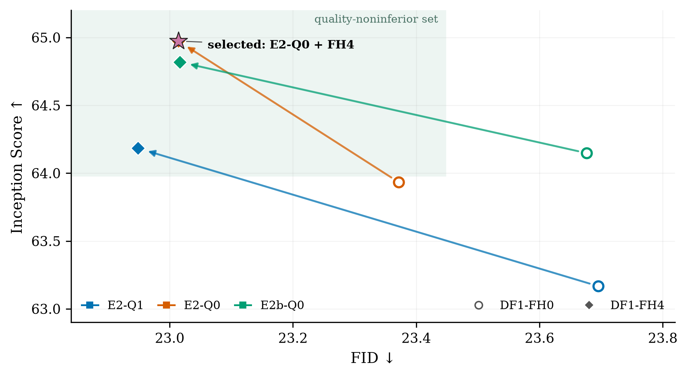

# Qwen Backbone × Flow-Head Position Ablation

We evaluate three retained Qwen image backbones with the two `DF1` position
contracts on ImageNet-100. All six models are trained from scratch for 35,920
steps with seed 42 and evaluated using the final EMA checkpoint on 10,000
samples. `FH0` uses additive 2D positions without flow-head RoPE, whereas
`FH4` removes additive positions and uses row/column 2D RoPE.

| Qwen backbone | Flow position | FID ↓ | IS ↑ |
| --- | --- | ---: | ---: |
| `E2-Q1` | `DF1-FH0` | 23.695 | 63.167 ± 1.149 |
| `E2-Q1` | `DF1-FH4` | **22.949** | 64.184 ± 1.195 |
| `E2-Q0` | `DF1-FH0` | 23.372 | 63.933 ± 1.360 |
| **`E2-Q0`** | **`DF1-FH4`** | 23.014 | **64.974 ± 0.967** |
| `E2b-Q0` | `DF1-FH0` | 23.677 | 64.148 ± 1.286 |
| `E2b-Q0` | `DF1-FH4` | 23.017 | 64.819 ± 1.304 |

**Figure 1.** Moving from `FH0` to `FH4` improves both FID and IS for every
backbone. The shaded region denotes the preregistered quality-noninferior set
(`FID ≤ FID_best + 0.5`, `IS ≥ IS_best − 1.0`). [Vector PDF](assets/backbone_flow_head_joint_ablation/joint_ablation.pdf).

## Conclusion

`FH4` consistently improves FID by 0.36–0.75 and IS by 0.67–1.04 across the
three backbones. All `FH4` variants enter the quality-noninferior set.
We select **`E2-Q0 + DF1-FH4`**: it is within 0.065 FID of the best model,
achieves the highest IS, and removes additive absolute position from both
image towers. Both attention stacks therefore use the same row/column 2D RoPE
contract, yielding the cleanest architecture for scaling to larger token
grids.

These results establish the default architecture for the current model
version. Since the comparison uses a single training seed, it should not be
interpreted as a multi-seed significance result.

The full protocol and execution history are retained in the
[archived proposal](archive/SELFLESS_FLOW_BACKBONE_FLOW_HEAD_JOINT_ABLATION_PROPOSAL_HISTORICAL.md);
machine-readable results are available in the
[seed-42 summary](../output/backbone_flow_head_joint_ablation/evidence/summary_seed42.json).
