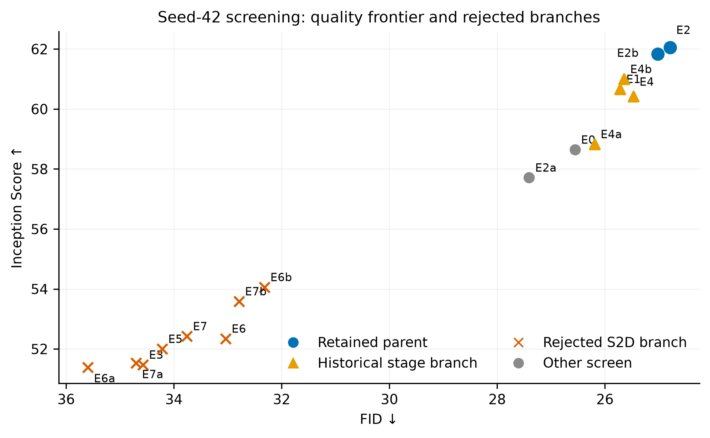
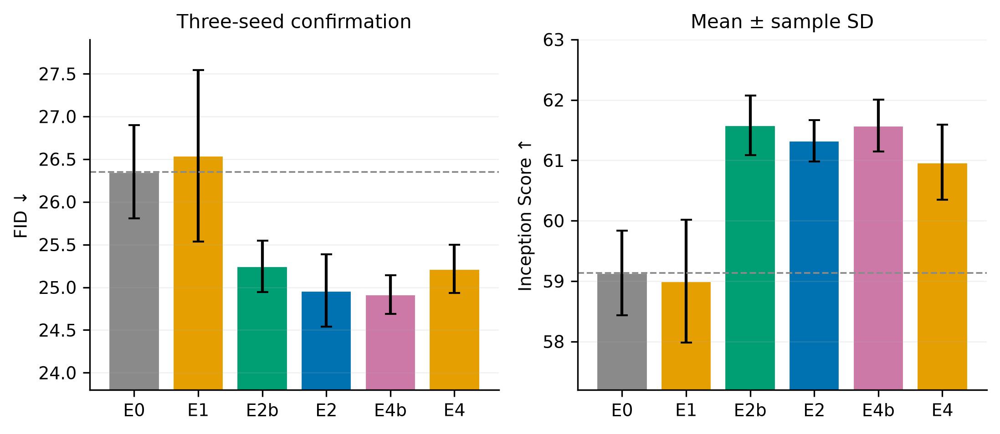
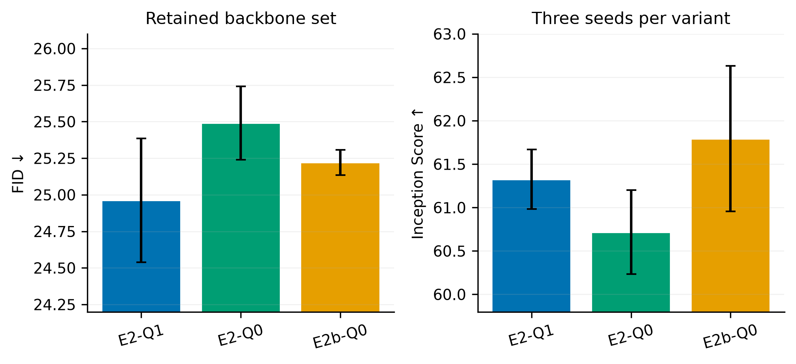

# Selfless-Flow Image Backbone 消融归档与最终接口

Status: **completed and archived**

Final runtime set: **E2-Q1 / E2-Q0 / E2b-Q0**

Standalone-backbone historical default: **E2-Q1**

Current joint-system default: **E2-Q0 + DF1-FH4**

Last updated: 2026-07-23

## 1. 最终决定

Backbone 消融已经收敛。代码、配置和后续实验只允许以下三个离散
`image_backbone_variant`：

| Variant | Observed latent additive 2D position | Mask-query additive 2D position | Image RoPE | 角色 |
| --- | ---: | ---: | --- | --- |
| **E2-Q1** | 无 | 有 | row/column 2D | **本轮历史默认**；复用旧 E2 的三 seed 结果 |
| **E2-Q0** | 无 | 无 | row/column 2D | 简洁性 control |
| **E2b-Q0** | 有 | 无 | row/column 2D | observed-position control；三者中 IS 最高 |

三者都固定：

- 无 stage embedding；
- 无 S2D/D2S；
- 无 sequence-1D image RoPE；
- 直接使用 square latent token grid；
- 使用同一 contextual flow head 架构和训练/评测协议。

本轮独立 backbone 消融当时默认 `E2-Q1`。后续 matched `3×2` joint screen 已在
`DF1-FH0/FH4` 上重新训练三个 runtime backbone，并把新训练默认更新为
`E2-Q0 + DF1-FH4`。以后 caption、noise、sampling 等其他消融以该 joint-system
默认开始；backbone 仍只能从这三个离散接口中选择，不再自由组合
position/stage/layout 开关。
随后完成的 flow-head architecture 实验定义在
[`SELFLESS_FLOW_DUAL_STREAM_FLOW_HEAD_ABLATION_PROPOSAL.md`](SELFLESS_FLOW_DUAL_STREAM_FLOW_HEAD_ABLATION_PROPOSAL.md)，
其当时的主矩阵固定使用 `E2-Q1`。

最终联合决定见
[`SELFLESS_FLOW_BACKBONE_FLOW_HEAD_JOINT_ABLATION.md`](SELFLESS_FLOW_BACKBONE_FLOW_HEAD_JOINT_ABLATION.md)；
其中的 system-level 结论 supersede 本文的独立 backbone 默认，但不改变本文历史数据。

旧 Q1 不重新训练：`E2-Q1` 直接复用旧 `E2` 的 seeds 43/44/45。历史上误启动的
fresh Q1 作业已停止，不进入任何汇总。`E2b-Q1` 仅作为历史 Q1 control 留在原始证据
中，不是受支持的 runtime variant。

2026-07-26 归档收紧时，4 个既无 final model 也无 metrics 的已停止运行被裁剪；
其配置、provenance、日志、验证记录与 checkpoint metadata 保留在
`output/image_backbone_ablation/evidence/pruned_partial_runs/`，完整运行未改动。

## 2. 为什么本轮独立消融当时默认 E2-Q1

需要区分两个层次的结论：

1. **历史严格 selector**：在当时允许 stage 的候选空间中，E4b 的 mean FID
   `24.9173` 最低，因此原预注册规则 nominally 选择 E4b。
2. **当前工程接口**：stage 分支出现过未初始化 buffer 导致的 NaN，且三 seed
   confirmation 没有显示稳定、可解释的 stage 主效应。我们已经明确不保留 stage
   接口，因此 E4/E4b 不属于当前可部署候选。

在无 stage 的合法候选中，E2-Q1 的 mean FID 为 `24.9615`，只比历史 E4b 高
`0.0442`，IS 低 `0.2520`；它同时保留了最清晰的职责分工：observed latent 只承载
content，mask query 用 absolute position 标识预测位置，attention 用 row/column 2D
RoPE 表达相对空间关系。因此选择 E2-Q1 作为默认，而不是把一个数值上微小、工程上
不稳定的 stage 收益带进长期接口。

## 3. 实验协议

- 数据：ImageNet-100 balanced；
- 训练：80 epochs，正式 confirmation 使用 seeds `43/44/45`；
- 评测：10,000 张 validation samples，100 类每类 100 张；
- FID reference：original ImageNet cached Inception statistics；
- 生成：CFG `3.5`，100-step Heun，temperature `1.0`，
  `parallel_rate=1`，`spatial_halton`；
- 模型：bf16，checkpoint weights fp32，VAE/flow integrator fp32；
- 统计：表中为三 seed mean ± sample SD；FID 越低越好，IS 越高越好。

Flow head 的 class、depth、width、heads、gating、optimizer 和 evaluation noise/sample
pairing 在正式比较中固定；每个 run 仍独立训练自己的权重，所以结果是
end-to-end system effect，不是冻结同一组 flow-head weights 的局部前向比较。

## 4. Seed-42 screening



[Vector PDF](assets/image_backbone_ablation/backbone_screening.pdf)

| ID | 主要变化 | FID | IS | 结论 |
| --- | --- | ---: | ---: | --- |
| E0 | 旧 baseline | 26.556 | 58.643 | baseline |
| E1 | stage only | 25.717 | 60.665 | 单 seed 看似改善，后续不稳定 |
| E2a | 去 observed additive only | 27.407 | 57.711 | 单独去除不够 |
| E2b | row/column 2D RoPE | 25.019 | 61.842 | 进入 confirmation |
| E2 | 2D RoPE + 去 observed additive | **24.789** | **62.052** | 进入 confirmation |
| E3 | S2D only | 34.574 | 51.472 | 明显退化 |
| E4a | stage + 去 observed additive | 26.192 | 58.827 | 不保留 |
| E4b | stage + 2D RoPE | 25.643 | 60.998 | 进入历史 confirmation |
| E4 | stage + E2 | 25.471 | 60.425 | 进入历史 confirmation |
| E5 | stage + S2D | 34.218 | 51.997 | 明显退化 |
| E6a | S2D + 去 observed additive | 35.597 | 51.390 | 明显退化 |
| E6b | S2D + 2D RoPE | 32.322 | 54.057 | 明显退化 |
| E6 | S2D + E2 | 33.041 | 52.340 | 明显退化 |
| E7a | stage + E6a | 34.706 | 51.527 | 明显退化 |
| E7b | stage + E6b | 32.793 | 53.584 | 明显退化 |
| E7 | full historical proposal | 33.759 | 52.421 | 明显退化 |

Screen 的最稳定信号是 row/column 2D RoPE；所有 S2D 分支形成一个独立的低质量簇。
S2D 即使数值可逆，也把 token count 从 256 改成 64、latent width 从 16 改成 64、
reveal 原子从单 site 改成 `2×2` block，并改变 flow-head 输入/输出接口，因此不是
“固定 flow head 后只消融 embedder”。它不只是效果差，而且实验问题本身不成立。

## 5. 三 seed confirmation



[Vector PDF](assets/image_backbone_ablation/backbone_confirmation.pdf)

| ID | FID ↓ | IS ↑ | 相对 E0 |
| --- | ---: | ---: | --- |
| E0 | 26.3528 ± 0.5440 | 59.1364 ± 0.6996 | baseline |
| E1 | 26.5397 ± 1.0029 | 58.9994 ± 1.0153 | stage 主效应不成立 |
| E2b | 25.2463 ± 0.3010 | **61.5805 ± 0.4910** | FID -1.1065，IS +2.4441 |
| E2 | 24.9615 ± 0.4231 | 61.3253 ± 0.3437 | FID -1.3913，IS +2.1889 |
| E4b | **24.9173 ± 0.2263** | 61.5773 ± 0.4293 | 历史 nominal FID best；含 stage |
| E4 | 25.2157 ± 0.2824 | 60.9682 ± 0.6202 | stage given E2 反而退化 |

逐 seed 的 `FID / IS` 原始结果如下，避免只保留聚合统计：

| ID | Seed 43 | Seed 44 | Seed 45 |
| --- | ---: | ---: | ---: |
| E0 | 26.4519 / 58.5587 | 25.7660 / 59.9143 | 26.8405 / 58.9362 |
| E1 | 27.6554 / 58.1745 | 26.2505 / 58.6905 | 25.7131 / 60.1333 |
| E2b | 25.1747 / 61.6216 | 24.9876 / 62.0496 | 25.5766 / 61.0703 |
| E2 | 25.4479 / 61.2518 | 24.6781 / 61.0243 | 24.7586 / 61.6998 |
| E4b | 24.7745 / 61.0840 | 25.1782 / 61.7817 | 24.7992 / 61.8663 |
| E4 | 24.8937 / 61.3742 | 25.4213 / 61.2760 | 25.3320 / 60.2543 |

关键效应：

- `E1-E0`：FID `+0.1869`、IS `-0.1370`，stage only 没有收益；
- `E2b-E0`：FID `-1.1065`、IS `+2.4441`，2D RoPE 是主要收益；
- `E2-E0`：FID `-1.3913`、IS `+2.1889`；
- `E4-E2`：FID `+0.2541`、IS `-0.3571`，在 E2 上加 stage 变差；
- `E4b-E2b`：FID `-0.3290`、IS `-0.0032`，仅有小 FID 变化且无 IS 收益。

因此 stage 的结果依赖交互、幅度小且伴随工程不稳定，不能成为长期架构接口。

## 6. 最终保留的三个 backbone



[Vector PDF](assets/image_backbone_ablation/backbone_retained_variants.pdf)

| Variant | 数据来源 | FID ↓ | IS ↑ | 最终用途 |
| --- | --- | ---: | ---: | --- |
| **E2-Q1** | 复用旧 E2 Q1，3 seeds | **24.9615 ± 0.4231** | 61.3253 ± 0.3437 | **默认** |
| **E2-Q0** | fresh Q0，3 seeds | 25.4907 ± 0.2514 | 60.7160 ± 0.4837 | 无 additive control |
| **E2b-Q0** | fresh Q0，3 seeds | 25.2211 ± 0.0868 | **61.7933 ± 0.8390** | observed-position control |

Q-factor bridge 的逐 seed `FID / IS`：

| Variant | Seed 43 | Seed 44 | Seed 45 |
| --- | ---: | ---: | ---: |
| E2-Q1（复用） | 25.4479 / 61.2518 | 24.6781 / 61.0243 | 24.7586 / 61.6998 |
| E2-Q0 | 25.2202 / 60.6007 | 25.7172 / 60.3004 | 25.5348 / 61.2469 |
| E2b-Q1（复用 control） | 25.1747 / 61.6216 | 24.9876 / 62.0496 | 25.5766 / 61.0703 |
| E2b-Q0 | 25.3122 / 60.8722 | 25.2118 / 62.5139 | 25.1393 / 61.9939 |

历史 `E2b-Q1` control 为 FID `25.2463 ± 0.3010`、IS
`61.5805 ± 0.4910`。描述性 Q0-Q1 差值：

| Parent | ΔFID (Q0-Q1) | ΔIS (Q0-Q1) | 解读 |
| --- | ---: | ---: | --- |
| E2b | -0.0252 | +0.2128 | 基本持平；Q0 可保留 |
| E2 | +0.5292 | -0.6093 | E2 上 mask additive 更稳，支持默认 Q1 |

Q0 与 reused Q1 来自冻结的不同 source revision，因此这两个差值只作描述性桥接，
不能写成同源码 causal effect。它们足以决定保留哪些可用 backbone，但不支持更细的
机制归因。

## 7. 最终结论

1. **Row/column 2D RoPE 是可靠收益来源。**
2. **Observed latent additive position 不是默认所必需。** E2-Q1 让 content 和
   position 分工更干净，并取得保留集合中的最好 FID。
3. **Mask-query additive position 在 E2 上有价值。** 完全去掉 additive 的 E2-Q0
   在 FID/IS 上都更差，因此不设为默认。
4. **E2b-Q0 是有用的 control。** 它的 mean IS 最高，且跨 seed FID 很稳定。
5. **Stage 不保留。** 主效应不稳定、交互依赖强，并曾触发非持久 buffer 的 NaN。
6. **S2D 不保留。** 它既大幅退化，又改变生成原子和 flow-head 接口，不能回答固定
   flow head 下的 embedder 消融问题。

## 8. 失败闭环

| 事件 | 根因 | 处理与结果 |
| --- | --- | --- |
| E1/E7 初次评测出现 NaN | HF meta materialization 后，`persistent=False` 的 fixed stage buffer 是未初始化 storage；第一个非有限值出现在 step 1 的 stage lookup，不在 flow head/CFG/Heun | 没有用 `nan_to_num` 或丢样本掩盖；完成定位与健康复跑。最终接口删除整个 stage 分支 |
| `imgemb-c1-e2b-s45-ev` | `qb-prod-gpu071` 的 GPU device plugin 无法初始化 NVML，application 未启动 | 排除坏节点后以相同协议重试成功：10K samples，FID 25.5766，IS 61.0703 |
| `imgemb-qf-e2b-q0-s43-ev` | 原命令未激活仓库虚拟环境，启动即报 `ModuleNotFoundError: omegaconf` | retry 只增加 `source .venv/bin/activate`，其余评测语义不变；10K samples，FID 25.3122，IS 60.8722 |

两次 Job failure 都有成功 retry 和最终 metrics；没有把失败 run 当成零值、NaN 或缺失
样本写进汇总。

## 9. 代码与实验约束

新配置只写：

```yaml
model:
  image_backbone_variant: "E2-Q0"  # current default; E2-Q1 | E2-Q0 | E2b-Q0
```

旧 checkpoint 兼容只允许三种精确映射：

- historical E2 + implicit/explicit Q1 → E2-Q1；
- historical E2 + Q0 → E2-Q0；
- historical E2b + Q0 → E2b-Q0。

任何 stage、S2D、sequence-1D image RoPE、E2b-Q1 或新 enum 与旧独立开关混用都会
直接报错。历史 launchers 已移入 archive 并设置为拒绝执行，防止旧 Q1 被重提。

## 10. 证据与归档

所有相关 output 已集中到：

```text
output/image_backbone_ablation/
├── runs/       # 47 个历史训练/评测 run 目录
├── evidence/
│   ├── screening_and_confirmation/
│   └── mask_position_q_factor/
└── relocation_manifest.json
```

原始 JSON/CSV 没有因移动而改写，内部记录的旧绝对/相对路径由
`relocation_manifest.json` 做 longest-prefix 映射。关键证据：

| Artifact | SHA256 |
| --- | --- |
| seed-42 screening summary | `2e4fa9c4bd5c135b2693e6d6f853865f5363b7de869619a9315aff8c587dbb5b` |
| 6×3 confirmation summary | `eefd9839fb7ba4e9d5a2663ed59413f7cda4dffa1878cced2e835ba3f3f35f1b` |
| Q0/Q1 legacy bridge summary | `d1b169530c00e60dcee85afdbbd84e257999337e16fd22cd6d78755ad7c9750f` |
| Q0 metrics attestation | `30491a0d5a4e24cbe44a523fa0b644a2a423ed248996f393faeda10049ac9cf3` |
| confirmation evaluation incidents | `df88bfb784204393ba7d4f323a21cf607f45fa80c4c7b47c172e371eefdee449` |
| Q-factor evaluation incidents | `cae51b14ef649b4b00aea5a957c37b5bb36f1c49af3588c36bd8a2418e92e003` |

图由
[`docs/assets/image_backbone_ablation/gen_fig_backbone_ablation.py`](assets/image_backbone_ablation/gen_fig_backbone_ablation.py)
从上述 JSON 直接生成，每张同时提供 300-DPI PNG 和 vector PDF。

完整的历史 proposal、原矩阵定义、预注册规则和失败排查记录保存在
[`docs/archive/SELFLESS_FLOW_IMAGE_TOKEN_EMBEDDER_ABLATION_PROPOSAL_HISTORICAL.md`](archive/SELFLESS_FLOW_IMAGE_TOKEN_EMBEDDER_ABLATION_PROPOSAL_HISTORICAL.md)；
它用于审计，不再定义当前 runtime interface。
