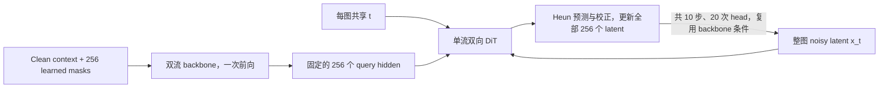

# Z

由 S2-single 相对 B 的结果提出的整图去噪实验。改动前工作区保存于 Git commit `6596710`。

核心是**同一幅图的 token 共用 sigma，以及单流双向 DiT head**。沿用 B 的双流 Qwen3 backbone：query 读取 `sigma_kv < sigma_q`，content 读取 `sigma_kv <= sigma_q`，不修改 attention 层。

## 可见性与时间

| 位置 | Query 流 | Content 流 |
| --- | --- | --- |
| 文本 | 保持 B 的同位置预测，只读更早内容 | 保持 B，包含自身 |
| 图像 | 不读自身图像的任何 clean latent，读取更早上下文 | 图像内部全部双向可见 |
| 图像之后的文本 | 读取整幅 context 图像 | 读取整幅 context 图像 |

`image_sigma_order=joint` 直接生成相同 sigma，不抽样 token 的生成顺序。不同图像仍按上下文顺序排列；packed segment 之间保持隔离。BOI/EOI 沿用 B 的图像前置 sigma，不能成为目标 latent 泄漏到 query 的中转路径。

图像 query 输入沿用 B 的 learned image-mask embedding，共 256 个位置，通过已有 2D RoPE 区分位置。训练时 content 流可读取 clean 图像，目标图像的 query 流始终不能读取它。生成时目标图的 content 槽也填入 mask，context 图像填入 clean latent。



每份 Monte Carlo 样本抽一个图像级 t 和一幅独立高斯噪声：`x_t = (1-t) noise + t clean`，回归速度 `clean-noise`。保持 RF4；四份样本共享一次 backbone 前向得到的条件，梯度仍回传 backbone。t 和 x_t 只进入 DiT，DiT 没有 clean content 流。

DiT 输入是 noisy latent 的投影加固定 query 条件的投影，使用 8 层、宽 1280、20 query heads / 5 KV heads、head dim 64、MLP intermediate 1472、2D RoPE 与时间 AdaLN。Head 有 **163,317,520** 参数，B 为 164,072,976，相差 **−0.4604%**。

## 训练与生成协议

- 从 Qwen3-0.6B-Base step 0 初始化，全参数训练；保留 B 的数据、任务顺序、batch、GA4、RF4、loss 权重、优化器、WSD 与 EMA，预算为 64 卡、95,415 updates。
- `image_input_noise_strength=0.01` 与 B 一致：仅训练时对 backbone 的图像输入做轻微扰动，验证／生成时关闭；这项增强不使用 flow 时间 t。
- 默认 Heun10，与 B 保持相同 solver 和步数；每个 batch 实际一次 backbone、20 次 DiT（每步预测与校正各一次）。CFG 条件／无条件分支沿 batch 维合并，调用次数不增加，计算量对应两个分支。
- Heun5 才对应 10 次 head forward；它不作为默认严格对照。比较速度时同时报告 solver、步数、实际前向次数和 CFG。
- 图像理解评分使用固定整图可见性，order MC=1；文本仍使用 B 的同位置 query 分数。ImageNet 候选评分复用 B 的前缀缓存，同一幅双向可见的 context 图像只计算一次；缓存前后分数经过一致性检查。Caption/text 生成也保留 KV cache。
- 保存完整 checkpoint、raw HF 和 EMA HF；本实验禁用旧 flow adapter 导出。

配置：[unified_z_100b_ascend64.yaml](../configs/selfless/unified_z_100b_ascend64.yaml)。模型：[modeling_joint_dit.py](../models/modeling_model/modeling_joint_dit.py)。

## 每轮验证的图像

Z 在每次训练验证时额外生成 **16 张 EMA 图像**；当前验证频率为每 10,000 个 optimizer steps。使用[固定 prompt 集](../configs/protocols/unified_qualitative_prompts_v1.json)的前 16 条，覆盖动物、物品与风景；每条 prompt 的初始噪声固定为 CPU FP32、seed `42 + 1000003 × prompt_index`，不随 step 或 rank 改变。采样为 CFG 3.5、Heun10、256 个 latent，对应 256×256 像素。

实际统一验证入口依次执行当前权重 loss、EMA 图像生成、EMA 下游评分。生成不使用下游评分的时间预算，每轮都会执行；配置开关为 `experiment.validation_generation.enabled`。所有 rank 参与分片 EMA 切换，各生成 rank 一次处理一张图，空闲 rank 不加载 VAE。完成或失败均恢复训练权重、模块模式和随机数状态，VAE 在本轮后释放。

每轮保存至：

```text
output/evaluation/training-validation/unified-z-0p6b-100b-imagenet-split-s42-r1/
  validation_generation/step-10000/
    00-red_panda.png … 15-snow_mountain.png
    overview.png
    index.html
    summary.json
    sample-00.json … sample-15.json
  validation_summary_step_10000.json
```

总览图和 HTML 展示全部样本；JSON 记录 prompt、种子、EMA step、采样参数和 1/20 前向次数。训练日志额外记录生成张数、耗时和完成状态。实现见 [training_image_generation.py](../utils/training_image_generation.py)。

## 复现

CPU 合同与资产检查：

```bash
TORCH_DEVICE_BACKEND_AUTOLOAD=0 .venv/bin/python scripts/validate_z.py --assets
.venv/bin/python scripts/launch_z.py --smoke --dry-run
bash script/check_repo.sh
```

固定 `dev-wjx-ascend` 上验收真实数据训练 0→12 步、完整 checkpoint 恢复到 14 步、raw/EMA 重载、完整 256-latent Heun10 生成及文本生成：

```bash
bash script/selfless/pretraining_z_ascend64.sh --smoke-suite \
  --label <unique-label> \
  --output-dir output/experiments/z/<smoke-directory>
```

训练验证验收：训练 5 步，在第 2、4 步执行完整 loss、16 张 EMA 图像、下游评分，再从 checkpoint-5 恢复到第 6 步。

```bash
bash script/selfless/pretraining_z_ascend64.sh --smoke-suite --validation \
  --label <unique-label> \
  --output-dir output/experiments/z/<validation-smoke-directory>
```

正式 4 节点 × 16 卡 Job 入口（先通过设备 smoke，并按 [Inspire](../INSPIRE.md) 查询 live 配额和 dry-run）：

```bash
bash script/selfless/pretraining_z_ascend64.sh
```

支持通过同一入口的 `--resume-from-checkpoint <path>` 严格恢复完整状态。正式目录为 `output/unified-z-0p6b-100b-imagenet-split-s42-r1`；设备 smoke 使用独立目录。

## 验证范围

[test_joint_dit.py](../tests/test_joint_dit.py) 检查双流 attention 真值表、整图 context、目标及未来文本不泄漏、训练 CFG 丢弃、RF4 共享时间、DiT 双向依赖、Heun 的 1/20 调用次数、预测与校正数值、256-token 生成、cached/full caption 一致性、checkpoint 重载及参数／训练预算。

早期原型曾在 Euler10、`image_input_noise_strength=0` 下通过 16 卡训练、恢复与生成检查，原始记录保留于 `output/experiments/joint-dit/smoke-20260915-r1/`；这不属于当前 Z 的严格对照设置。Z 的正式协议为 Heun10、输入微噪声 0.01，后续验收记录放在 `output/experiments/z/`。短程 smoke 仅验证执行正确性，不代表图像质量结果。
