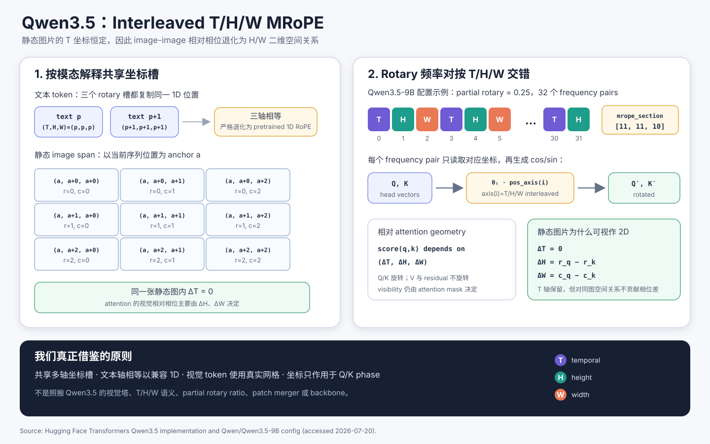
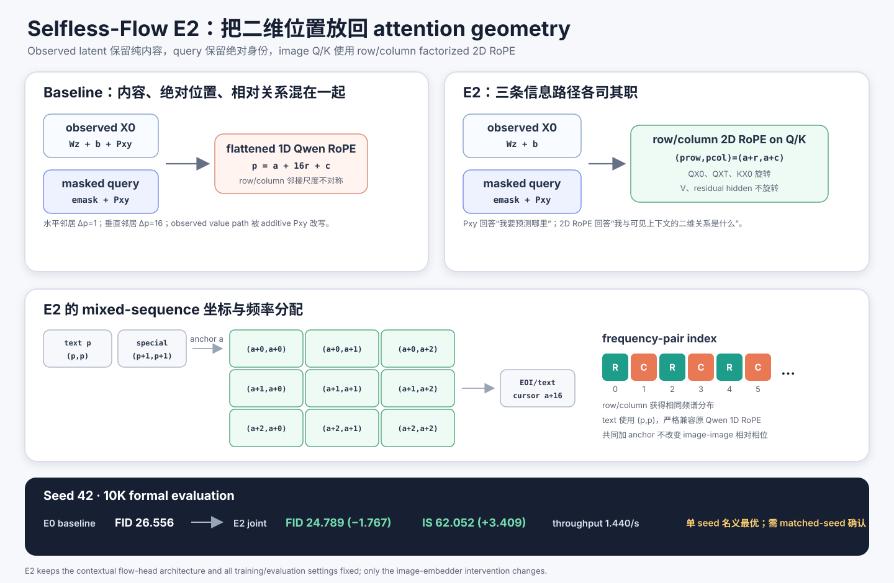

# Selfless-Flow E2：Row/Column 2D RoPE 改进（历史组会材料）

> Archived 2026-07-23. 本文保留 seed-42 阶段的历史判断，不再定义当前接口。
> 最终三 seed 结果、Q0/Q1 bridge 与受支持的 `E2-Q1 / E2-Q0 / E2b-Q0` 请见
> [`../SELFLESS_FLOW_IMAGE_TOKEN_EMBEDDER_ABLATION_PROPOSAL.md`](../SELFLESS_FLOW_IMAGE_TOKEN_EMBEDDER_ABLATION_PROPOSAL.md)。

> 组会材料，2026-07-20。结论基于 seed 42、10K-sample formal FID/IS；E2 当前是
> 单 seed 名义最优，最终架构仍需 matched-seed confirmation。

## 一页结论

E2 不更换 Qwen3 backbone，也不修改已经固定的 contextual flow-head architecture。
它只重构 image token 的位置信息路径：

1. **Observed latent 只保留内容**：`h_X0 = Wz + b`，不再把 additive `P_xy`
   混入 observed hidden/value path；
2. **Query 保留绝对身份**：`h_Q = e_mask + P_xy`，保证生成初期在零个或一个可见
   image key 时仍知道“当前要预测哪里”；
3. **相对空间关系进入 Q/K phase**：image token 使用 row/column factorized 2D
   RoPE；value 与 residual hidden 不旋转；
4. **纯文本严格兼容原 Qwen 1D RoPE**：text/special token 使用坐标 `(p,p)`；
5. **没有 stage embedding，没有 S2D**：E2 只测二维 relation 与 content-position
   解耦的 joint effect。

Seed 42 的正式结果：

| Variant | Observed additive `P_xy` | Backbone RoPE | FID ↓ | IS ↑ | samples/s ↑ |
| --- | --- | --- | ---: | ---: | ---: |
| E0 | 保留 | flatten 1D | 26.5556 | 58.6427 ± 1.3747 | 1.5321 |
| E2a | **去除** | flatten 1D | 27.4070 | 57.7110 ± 1.4553 | 1.5436 |
| E2b | 保留 | **row/column 2D** | 25.0185 | 61.8418 ± 0.7798 | 1.4684 |
| **E2** | **去除** | **row/column 2D** | **24.7886** | **62.0522 ± 1.4196** | 1.4400 |

相对 E0，E2 的 FID 改善 **1.7670（6.65%）**，IS 提高 **3.4095**；代价是
sampling throughput 下降约 **6.0%**。E2b 与 E2 只差 0.2299 FID，因此两者都应进入
matched-seed confirmation，不能用单个 seed 宣布稳定胜负。

---

## 1. Baseline 的问题：二维图像被压成一维 attention geometry

当前图像 latent 是 `16×16×16`，展平为 256 个 token。Baseline 同时做了两件事：

\[
h^{X0}_{\text{base}} = W_z z + b_z + P_{xy}(r,c),
\qquad
h^{Q}_{\text{base}} = e_{mask} + P_{xy}(r,c),
\]

并让文本与图像 token 共用 flatten sequence 的 1D Qwen RoPE：

\[
p_{\text{flat}} = a + 16r + c.
\]

这会产生两类耦合：

- **内容与位置相加**：observed latent 的 value/residual representation 被 `P_xy`
  直接改写；
- **二维邻接被一维化**：水平邻居的 `Δp=1`，垂直邻居的 `Δp=16`，相同物理距离
  在 attention phase 中对应完全不同的尺度。

E2 的核心不是“增加更多 position embedding”，而是把三种职责拆开：

| 信息 | E2 中的路径 |
| --- | --- |
| latent 内容与幅值 | observed `Wz+b` / value path |
| 当前 query 的绝对位置 | query seed 中的 fixed `P_xy` |
| query-key 的二维相对关系 | Q/K 的 row/column 2D RoPE |

---

## 2. Qwen3.5 给我们的启发

### 2.1 先澄清：“Qwen3.5 2D RoPE”实际是什么

Qwen3.5 的公开实现是 **T/H/W 三轴 multimodal RoPE（MRoPE）**，并不是一个只含
H/W 的专用 2D 模块。对静态图片，所有 patch 的 temporal coordinate 相同，因此
同一图片内部 `ΔT=0`，image-image relative phase 才退化为 H/W 二维关系。



官方实现有三个值得借鉴的原则：

1. **共享 coordinate slots**：文本与视觉 token 走同一个 rotary mechanism；
2. **按模态解释坐标**：文本把同一个 1D position 复制到 T/H/W，视觉 token 使用
   真实网格；
3. **频率交错而不是分块**：frequency pairs 按 T/H/W 交错，使不同轴共享连续的
   频谱范围。

以官方 Qwen3.5-9B 配置为例：

```text
partial_rotary_factor = 0.25
mrope_interleaved     = true
mrope_section         = [11, 11, 10]
rope_theta            = 10,000,000
```

32 个 rotary frequency pairs 的轴来源等价于：

```text
T, H, W, T, H, W, ..., T, H
```

当文本使用 `(T,H,W)=(p,p,p)` 时，每个 frequency pair 看到的仍是同一个 `p`，
因此 rotary phase 退化为标准 1D RoPE。

### 2.2 我们借鉴什么、不照搬什么

我们只借鉴：

> 共享多轴坐标槽、文本轴相等以保持 1D 兼容、视觉 token 使用真实空间网格、坐标只
> 作用于 Q/K phase。

我们**没有**迁移 Qwen3.5 backbone、视觉塔、T/H/W 语义、partial rotary ratio、
patch merger 或 linear-attention layout。Selfless-Flow 当前 backbone 仍是
Qwen3-0.6B-Base；E2 只实现适合当前生成任务的 row/column 两轴版本。

官方资料：

- [Hugging Face Qwen3.5 documentation](https://huggingface.co/docs/transformers/model_doc/qwen3_5)
- [Qwen3.5 Transformers implementation](https://github.com/huggingface/transformers/blob/main/src/transformers/models/qwen3_5/modeling_qwen3_5.py)
- [Qwen3.5-9B official config](https://huggingface.co/Qwen/Qwen3.5-9B/blob/main/config.json)

---

## 3. E2 的具体设计



### 3.1 Mixed-sequence coordinate rule

E2 构造两个 rotary coordinate slots：row 与 column。

对 text/special token：

\[
(p_{row},p_{col})=(p,p).
\]

对 image token `(r,c)`，以 image span 开始处的 running cursor 为 anchor `a`：

\[
(p_{row},p_{col})=(a+r,a+c).
\]

Image span 结束后，cursor 增加 canonical spatial extent 16，而不是增加 flattened
token count 256；后续 EOI/text 从 `a+16` 继续。这样做有三个性质：

- image-image relative phase 中 anchor `a` 自动相消；
- text 与 image 仍位于同一个 coordinate frame；
- 纯文本序列与 pretrained Qwen 的 running 1D position 完全一致。

注意：RoPE coordinate **不决定可见性**。Selfless-Flow 的 attention visibility 仍由
strict reveal mask `sigma_kv < sigma_q` 决定。

### 3.2 Row/column frequency allocation

复用当前 Qwen 的原始 `inv_freq`，按 frequency-pair index 交错选择坐标：

```text
frequency-pair index: 0    1    2    3    4    5    ...
coordinate source:    row  col  row  col  row  col  ...
```

不能把“前一半频率给 row、后一半给 column”，因为那会让两个轴系统性获得不同频谱。
交错分配后，row/column 都覆盖从高频到低频的相同范围。

对每个 frequency pair `i`：

\[
\phi_i = \theta_i\,p_{axis(i)},
\qquad axis(i)=
\begin{cases}
row,&i\bmod 2=0,\\
col,&i\bmod 2=1.
\end{cases}
\]

文本坐标满足 `p_row=p_col=p`，因此 E2 的 2D rotary 输出与原 Qwen 1D rotary 输出
逐元素相同；repo 中已有 exact-equality test 覆盖这一点。

### 3.3 Hidden、Q/K/V 的信息分工

E2 的 observed 与 query embedding：

\[
h^{X0}_{image}=W_z z+b_z,
\qquad
h^{Q}_{image}=e_{mask}+P_{xy}(r,c).
\]

Backbone attention 中：

\[
\begin{aligned}
Q'_{X0} &= R_{row,col}(Q_{X0}),\\
Q'_{XT} &= R_{row,col}(Q_{XT}),\\
K'_{X0} &= R_{row,col}(K_{X0}),\\
V'_{X0} &= V_{X0}.
\end{aligned}
\]

不变项：

- Qwen backbone、层数、宽度、optimizer 与训练预算不变；
- contextual flow head 的 class/depth/width/heads/gating 不变；
- flow head 继续使用自己的 fixed 2D sin/cos query/context position；
- E2 不启用 query stage coordinate；
- E2 不启用 space-to-depth，仍是 `256 tokens × 16 channels`。

### 3.4 为什么 query 不能同时去掉 `P_xy`

2D RoPE 表达的是 pairwise relation，但不能单独提供绝对 query identity：

- 没有可见 image key 时，image-image relative phase 没有作用对象；
- 只有一个可见 key 时，softmax 权重恒为 1；
- Selfless-Flow 的早期 reveal 阶段恰好频繁出现这两种情况。

所以 E2 选择：observed content 去 additive position，query seed 保留 absolute `P_xy`。
这不是重复编码，而是 absolute identity 与 relative geometry 的职责分离。

---

## 4. 消融结果怎么解释

### 4.1 主要收益来自 2D RoPE，而不是简单删除位置

- **E2a：只删除 observed additive `P_xy`**
  - FID 从 26.5556 变差到 27.4070（`+0.8514`）；
  - 说明直接删除位置、但继续使用 flattened 1D relation 并不成立。
- **E2b：只换 row/column 2D RoPE**
  - FID 改善到 25.0185（`−1.5371`）；
  - 说明二维 Q/K geometry 是主要收益来源。
- **E2：两者联合**
  - FID 进一步改善到 24.7886；
  - 比 E2b 再好 0.2299 FID，但该差距需要多 seed 判断是否稳定。

以 `R_a=去 additive position`、`R_b=启用 2D RoPE` 写成 2×2 factorial contrast，
FID interaction 为：

\[
E2-E2a-E2b+E0=-1.0812.
\]

这个单 seed interaction 名义上是 favorable 的：删除 additive position 单独看是负面
改动，但在 2D RoPE 已经提供正确 relation 后，content-position 解耦可能带来额外收益。
它不等价于“E2a 与 E2b 的主效应简单相加”。

### 4.2 当前应如何选择

如果只看 seed 42：

- **质量优先**：E2 当前最好；
- **更保守、改动更小**：E2b 与 E2 非常接近，并且吞吐略高；
- **最终决定**：E0、E2、E2b 至少需要 seeds 43/44/45 的 matched-seed comparison，
  报告 paired ΔFID、95% CI 与训练/评测协议指纹。

目前不能把 0.2299 FID 的单 seed 差距表述成稳定胜出。

---

## 5. 组会建议讲法（约 5 分钟）

### Slide 1：问题

> 我们的 latent 本来是 16×16 网格，但 baseline attention 使用 flatten 1D RoPE。
> 同时 observed content 还直接加了绝对 Pxy，所以内容、绝对位置和相对关系混在一起。

### Slide 2：Qwen3.5 启发

> Qwen3.5 的静态图像并不是单独的 2D 模块，而是 T/H/W MRoPE 的一个切片：同图
> ΔT=0，只剩 ΔH/ΔW。关键思想是文本复制同一个位置到各轴，视觉 token 使用真实网格，
> 并把轴交错分配给 frequency pairs。

### Slide 3：E2 设计

> 我们不照搬 Qwen3.5，只做两轴版本。Observed latent 变成纯 `Wz+b`；query 仍保留
> `emask+Pxy`；row/column coordinate 只旋转 Q/K，V 不动。这样绝对身份和相对空间
> geometry 被明确拆开。

### Slide 4：结果

> 单独删除 observed Pxy 会变差；单独上 2D RoPE 已经显著变好；联合 E2 最好。
> 这说明收益主要来自正确的二维 relation，删除 additive position 只有在 2D relation
> 已存在时才可能有协同收益。

### Slide 5：结论与下一步

> E2 是当前 seed42 名义最优，E2b 是非常接近的更小改动。下一步不是继续堆模块，
> 而是用 matched seeds 判断 0.23 FID 是否稳定，再决定默认架构。

---

## 6. Repo 对应位置

- 最终归档：[`SELFLESS_FLOW_IMAGE_TOKEN_EMBEDDER_ABLATION_PROPOSAL.md`](../SELFLESS_FLOW_IMAGE_TOKEN_EMBEDDER_ABLATION_PROPOSAL.md)
- 历史 E2 matrix 定义：[`image_embedder_ablation_matrix.py`](../../scripts/archive/image_backbone_ablation/image_embedder_ablation_matrix.py)
- mixed row/column coordinate：[`image_position_utils.py`](../../models/modeling_model/image_position_utils.py)
- rotary 与 backbone 接入：[`modeling_selfless_flow.py`](../../models/modeling_model/modeling_selfless_flow.py)
- 历史兼容性测试：[`legacy_image_embedder_ablation.py`](../../scripts/archive/image_backbone_ablation/tests/legacy_image_embedder_ablation.py)
